# Bail Reckoner

## Product Requirements Document & System Blueprint

| Document field | Value |
|---|---|
| Version | 2.0 |
| Status | Revised product specification |
| Last updated | 16 July 2026 |
| Product stage | Modernized working baseline; production hardening required |
| Primary audience | Product, engineering, design, legal-content reviewers, security, and pilot partners |
| Implementation reference | Current `Bail-Reckoner` repository |
| Related documents | [`AUDIT.md`](AUDIT.md) · [`EXECUTION_PLAN.md`](EXECUTION_PLAN.md) · [`README.md`](../README.md) |

> [!IMPORTANT]
> Bail Reckoner is a **decision-support and legal-information platform**. It does
> not decide bail, predict a judicial outcome, replace qualified counsel, or issue
> a legally binding recommendation. Database-backed legal facts must remain
> distinguishable from AI-generated explanatory text throughout the product.

### Document map

| If you need to understand… | Read… |
|---|---|
| The product, users, goals, and boundaries | §§ 1–5 |
| The end-to-end experience and system design | §§ 6–8 |
| Functional requirements and permissions | §§ 9–10 |
| Data, APIs, quality, and operations | §§ 11–15 |
| Measures, delivery, risks, and open decisions | §§ 16–19 |
| Release proof, code traceability, and completion criteria | §§ 20–22 |

---

## 1. Executive Summary

Bail Reckoner helps people in the Indian criminal justice ecosystem move from an
opaque case situation to a clear next action. It brings four connected activities
into one experience:

1. explain the bail characteristics of an IPC section and its BNS mapping;
2. let an undertrial prisoner view case status and professional inputs;
3. connect a prisoner with a suitable nearby legal aid provider; and
4. give legal aid providers and judicial authorities structured case work queues.

The repository already contains a modernized baseline: one FastAPI application,
one relational database, a same-origin web frontend, JWT authentication, a seeded
legal-section knowledge base, provider-agnostic AI enrichment, and an offline
rule-based fallback. This PRD describes that product end to end and defines the
controls still required before real-person or production use.

### 1.1 Product promise

> **Understand the case, find the right help, and move the matter forward—without
> making access to basic legal information depend on a paid AI service.**

### 1.2 Product value chain

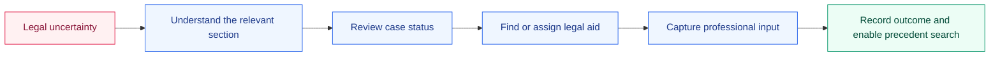

---

## 2. Problem Definition

### 2.1 User problem

Undertrial prisoners and their families often struggle to understand whether an
offence is bailable, what process may follow, who can provide affordable legal
support, and where a case currently stands. Legal aid providers need a simple way
to discover unassigned cases. Judicial authorities need a structured view of
matters awaiting an opinion or judgment.

The information and actions exist across different actors, but the hand-offs are
fragmented. Bail Reckoner creates a shared workflow while preserving human legal
judgment.

### 2.2 System problem addressed by the modernization

The original hackathon implementation required multiple backend processes and
databases, exposed sensitive information without authentication, embedded
credentials in code, and depended on a paid AI provider. The modernized baseline
has removed those architectural constraints. The remaining work is primarily
production safety, authorization, privacy, legal governance, and operational
readiness.

### 2.3 Why now

- The core product flow is implemented and testable in one application.
- A zero-credential mode makes pilots and local deployments practical.
- IPC-to-BNS transition support makes clear provenance and content review essential.
- The product handles highly sensitive personal and legal data, so production
  boundaries must be explicit before any real-person rollout.

---

## 3. Vision, Goals, and Principles

### 3.1 Vision

Create a trustworthy, accessible coordination layer that helps undertrial
prisoners understand bail-related information and helps justice-system actors move
cases through legal-aid and professional-review workflows.

### 3.2 Goals

| ID | Goal | Evidence of success |
|---|---|---|
| G1 | Make bail-related section information understandable | A user can retrieve a structured, source-governed answer by IPC section |
| G2 | Make case status legible to the affected prisoner | The prisoner can see status, hearing date, assigned lawyer, suggestions, and opinion |
| G3 | Reduce friction in finding legal help | Eligible providers are filtered and ranked by distance |
| G4 | Coordinate professional work | Providers and judicial authorities receive clear pending queues and can record actions |
| G5 | Work without mandatory paid infrastructure | Core workflows run with SQLite and the rule-based legal-information provider |
| G6 | Protect sensitive personal and case data | Access is role- and record-scoped, auditable, masked, and encrypted where required |

### 3.3 Product principles

1. **Verified facts lead.** Knowledge-base facts appear before generated explanation.
2. **Humans decide.** AI may explain; it must never approve, reject, score, or predict bail.
3. **Privacy by default.** A user sees only the minimum data needed for their task.
4. **Graceful degradation.** Provider failure must not break access to known legal facts.
5. **One clear next action.** Every role dashboard should make pending work obvious.
6. **Plain language.** Legal terminology should be explained without changing meaning.
7. **Traceability.** Material legal and case actions must have a source, actor, and time.

---

## 4. Users and Jobs to Be Done

| User | Primary need | Core jobs | Success state |
|---|---|---|---|
| Visitor | Understand the service before sharing data | Read about the platform; look up section information; discover legal aid | Gets useful public information without creating an account |
| Undertrial prisoner | Understand their case and obtain help | Register; sign in; view own case; understand charges; find a provider | Knows current status and how to seek qualified help |
| Legal aid provider | Find and support relevant cases | Maintain a provider profile; review unassigned matters; take up a case; add a suggestion; search history | A case is assigned with a traceable provider action |
| Judicial authority | Review and progress case records | Create or review matters; inspect pending opinions; record opinion and judgment; search history | The professional input and outcome are attached to the correct case |
| Authorized operator — future | Govern the platform safely | Verify professionals; manage content; investigate access; correct records | Operations are auditable and do not rely on a client-side admin stub |
| Legal-content reviewer | Keep legal information accurate | Review section mappings, wording, effective dates, and disclaimers | Published content has provenance and approval metadata |

### 4.1 Role boundaries

- A visitor may use only deliberately public legal-information and provider-search
  capabilities.
- A prisoner may access only records linked to their verified identity.
- A legal aid provider may see a minimum-data pending queue and full case data only
  after an authorized assignment.
- A judicial authority may access cases within their permitted jurisdiction or
  organizational scope.
- An operator role is **not currently server-backed** and is not in production
  scope until its permissions and audit controls are implemented.

---

## 5. Scope

### 5.1 Scope by delivery horizon

| Capability | Modernized baseline | Production release gate | Later enhancement |
|---|:---:|:---:|:---:|
| Single FastAPI app serving API and UI | ✓ |  |  |
| SQLite local mode and PostgreSQL configuration | ✓ |  |  |
| Three-role registration and JWT login | ✓ |  |  |
| Claim-aware role authorization |  | **P0** |  |
| Record-level prisoner and provider access control |  | **P0** |  |
| Bail information from seeded knowledge base | ✓ | Legal-content approval and provenance |  |
| Rule-based AI fallback | ✓ | Fallback and disclaimer telemetry |  |
| Optional Ollama, OpenRouter, and OpenAI providers | ✓ | Provider privacy review | Additional providers |
| Aadhaar case lookup | ✓ | Masking, encryption, purpose/consent review | Alternative case identifier |
| Provider distance ranking | ✓ | Provider verification and location privacy | Map view and radius search |
| Pending case and opinion queues | ✓ | Least-data queue responses and jurisdiction filters | Advanced workload management |
| Case suggestion, opinion, and judgment capture | ✓ | Actor/time audit history and controlled state transition | Notifications and reminders |
| Historical judgment search by IPC text | ✓ | Pagination and authorized result redaction | Structured/semantic search |
| Responsive, accessible, multilingual UI | Partial | Responsive + WCAG review | Indian-language localization |
| Monitoring, backups, migrations, runbooks | Partial | **P0** | Advanced analytics |

### 5.2 In scope for a production-ready pilot

- public section lookup with clear source and non-advice labeling;
- secure registration and sign-in for approved roles;
- role- and record-scoped case access;
- creation, assignment, professional review, completion, and history lookup;
- provider discovery using explicit user location consent;
- server-side audit events for sensitive reads and all case mutations;
- encrypted and masked sensitive identifiers;
- PostgreSQL deployment with schema migrations, backups, health monitoring, and
  documented recovery procedures;
- an accessible same-origin browser experience;
- automated tests for permissions, privacy, fallback, and the core case lifecycle.

### 5.3 Explicitly out of scope

- automated bail approval, denial, risk scoring, sentencing, or outcome prediction;
- replacement of a lawyer, judge, or official court record;
- court e-filing, police-system integration, prison-system integration, or e-signing;
- biometric Aadhaar authentication or identity verification through UIDAI;
- evidence credibility analysis, facial recognition, or witness assessment;
- payments, legal-fee collection, escrow, or marketplace commissions;
- emergency response or time-critical legal representation guarantees;
- a public searchable directory of prisoner or case PII;
- a production admin role implemented only in browser JavaScript.

---

## 6. End-to-End Product Experience

### 6.1 Experience map

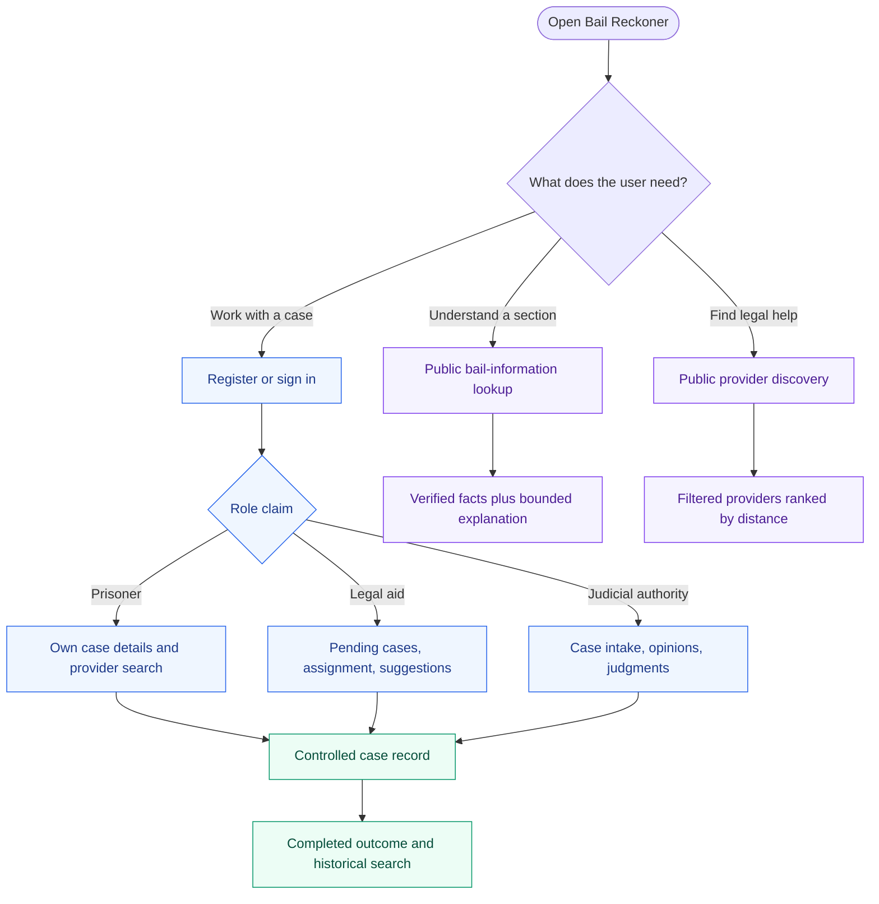

### 6.2 Navigation model

| Surface | Audience | Primary actions |
|---|---|---|
| Landing / About | Everyone | Understand purpose, limitations, privacy, and routes into the product |
| Guest legal lookup | Everyone | Submit an IPC section and receive structured bail information |
| Find an advocate | Everyone, with location consent | Set fee/experience filters and review distance-ranked providers |
| Register / Login | Account users | Create role-specific profile and authenticate |
| Role dashboard | Authenticated users | See identity, role, and the most relevant next action |
| Prisoner case details | Prisoner | View only own linked ongoing case and professional inputs |
| Provider work queue | Legal aid provider | Review redacted pending matters and take up a permitted case |
| Judicial work queue | Judicial authority | Review permitted pending opinions and record a professional opinion |
| Case intake / Completion | Authorized role | Create a validated case or complete an existing matter |
| Historical cases | Authorized professional | Search permitted completed judgments by normalized legal sections |

---

## 7. System Context and Architecture

### 7.1 Logical architecture

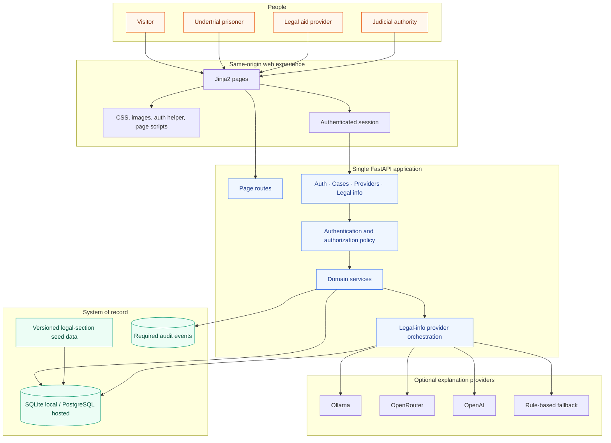

### 7.2 Runtime deployment

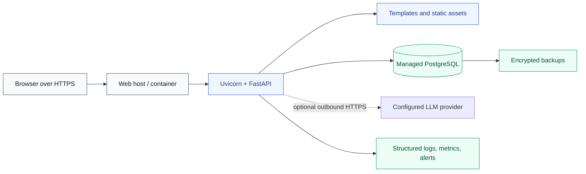

### 7.3 Architectural decisions

| Decision | Requirement |
|---|---|
| Single application | One process serves page routes, static assets, and `/api/*` endpoints |
| One relational data store | User, case, provider, and legal-section data use one governed schema |
| Same-origin frontend | Production does not require wildcard CORS and does not hardcode localhost URLs |
| Layered backend | Routes validate transport; services implement business rules; models persist data |
| Provider abstraction | Optional LLMs implement one interface and cannot change API contracts |
| Offline-first legal facts | The rule-based provider answers known sections without credentials or network access |
| Configuration outside code | Secrets and environment-specific settings come from environment variables |

---

## 8. Core Workflow Orchestration

### 8.1 Registration and authentication

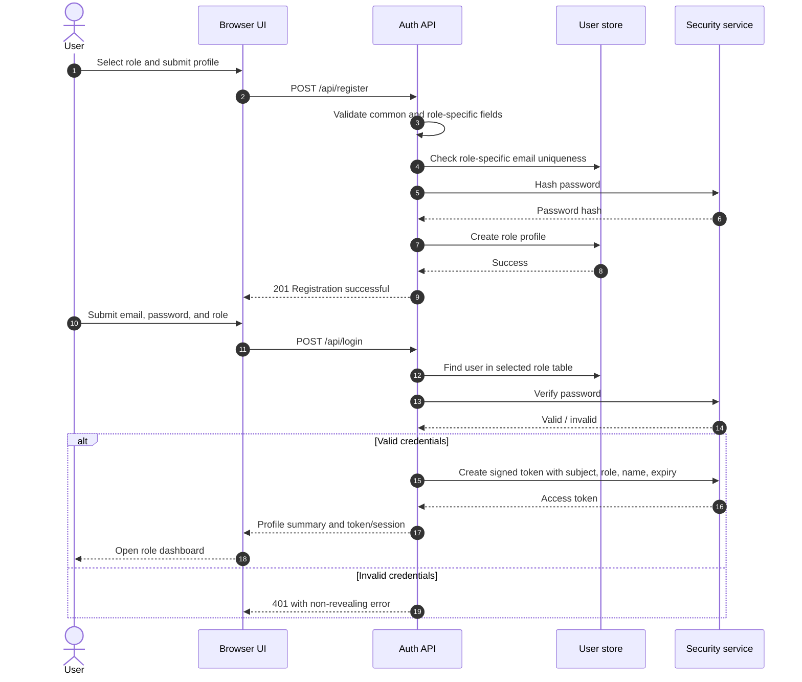

**Production requirements:** the server must enforce role and record ownership on
every sensitive request. Client-side role navigation is a usability feature, not a
security boundary. Prefer a secure, `HttpOnly`, `SameSite` cookie or a documented
token-hardening design over persistent browser-accessible token storage.

### 8.2 Case lifecycle across roles

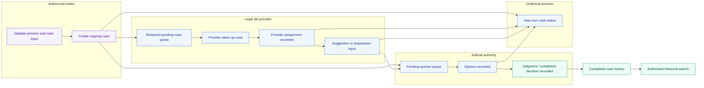

The current baseline stores ongoing and completed cases separately and exposes a
separate completed-case creation operation. Before production, completion must be
an atomic, authorized transition that prevents duplicate active/completed records
and preserves an immutable action history.

### 8.3 Case state model

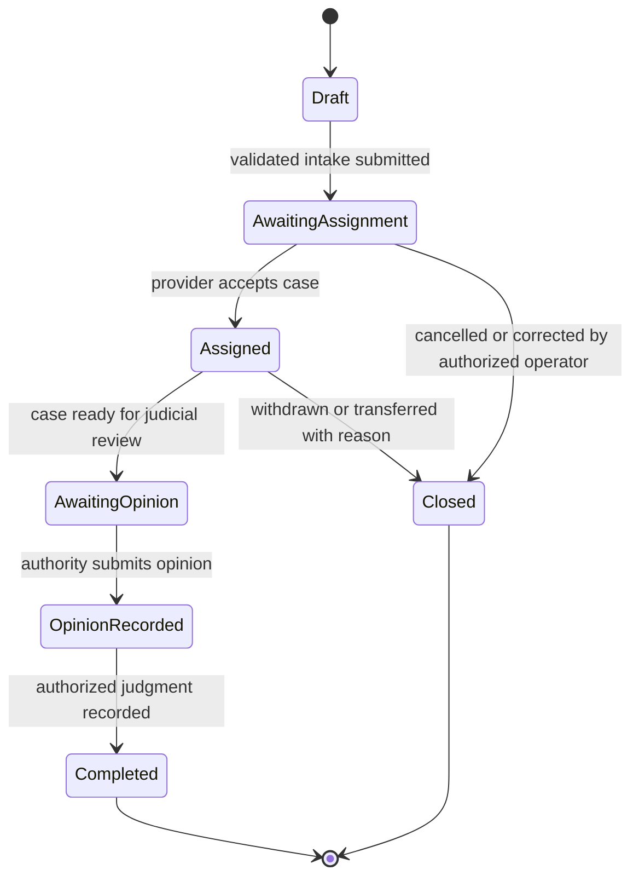

**State requirements:** production states must be controlled enums, each transition
must validate the actor and prior state, and corrections must append a new audit
event instead of overwriting history silently.

### 8.4 Bail-information orchestration

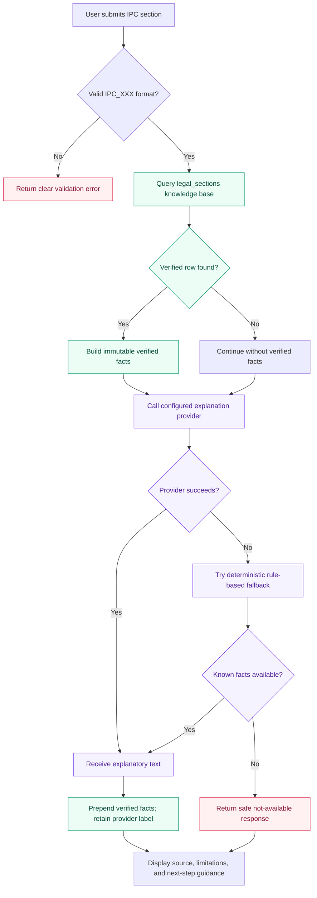

#### AI safety invariants

1. The database controls section identity, BNS mapping, offence type, and bailable
   status when a verified row exists.
2. Generated content must never override or restate those fields inconsistently.
3. The response identifies the provider used and whether a database row was found.
4. A remote provider timeout, missing key, malformed response, or outage falls back
   without exposing provider internals to the user.
5. Unknown sections produce an explicit “not available / verify the section” answer;
   they must not be fabricated by default.
6. Legal content requires version, effective date, source citation, and reviewer
   metadata before real-person use.
7. Every result includes a plain-language limitation and route to qualified help.

### 8.5 Legal-aid provider discovery

```mermaid
flowchart LR
    A["User grants location access or enters location"] --> B["Set maximum fee and minimum experience"]
    B --> C["Validate latitude, longitude, and filters"]
    C --> D["Query eligible provider profiles"]
    D --> E["Discard invalid or unverified locations"]
    E --> F["Calculate Haversine distance"]
    F --> G["Sort nearest first"]
    G --> H["Return minimal provider card"]
    H --> I["User contacts provider outside platform"]

    classDef input fill:#fff7ed,stroke:#ea580c,color:#7c2d12;
    classDef process fill:#eff6ff,stroke:#2563eb,color:#1e3a8a;
    classDef result fill:#ecfdf5,stroke:#059669,color:#064e3b;
    class A,B,C input;
    class D,E,F,G process;
    class H,I result;
```

Location collection must be consent-based and purpose-limited. The public result
must not reveal a provider’s precise stored coordinates; it should return only the
contact fields approved for directory use and an appropriately rounded distance.

### 8.6 Failure and fallback behavior

| Failure | User-visible behavior | System behavior |
|---|---|---|
| Invalid credentials | Generic sign-in failure | Do not reveal whether the email or role exists; record rate-limit telemetry |
| Expired or invalid session | Prompt to sign in again | Return 401; clear unusable client session |
| Authenticated but forbidden action | Explain that access is not permitted | Return 403; log actor, action, resource, and policy result |
| Unknown Aadhaar/case reference | No matching accessible case | Avoid confirming another person’s identity or record existence |
| Provider already took the case | Case is no longer available | Enforce one atomic assignment and return conflict |
| No providers match filters | Suggest widening fee/experience or location criteria | Return an empty list, not an error |
| External AI unavailable | Show verified rule-based answer when available | Record provider failure; execute fallback |
| Unknown legal section | Ask user to verify the section and consult qualified help | Do not invent a section or bail status |
| Database unavailable | Temporary service-unavailable message | Fail closed for writes; preserve trace ID; alert operator |

---

## 9. Functional Requirements

Priority meanings: **P0** is required before a real-person pilot, **P1** is required
for a mature pilot, and **P2** is an enhancement.

### 9.1 Identity and access

| ID | Pri. | Requirement | Acceptance signal |
|---|:---:|---|---|
| IAM-01 | P0 | Register a prisoner, legal aid provider, or judicial authority with role-specific validated fields | Valid profiles are created; incomplete or malformed profiles are rejected |
| IAM-02 | P0 | Store only a slow, salted password hash | Plaintext passwords never enter storage or logs |
| IAM-03 | P0 | Authenticate by email, password, and normalized role | Successful login creates an expiring authenticated session |
| IAM-04 | P0 | Enforce allowed roles server-side per endpoint | A valid token with the wrong role receives 403 |
| IAM-05 | P0 | Enforce record ownership and professional assignment | A prisoner cannot query another prisoner’s record; a provider cannot open an unassigned full record |
| IAM-06 | P0 | Protect professional registration through verification/approval | Unverified professional accounts cannot access professional queues |
| IAM-07 | P0 | Rate-limit login, registration, Aadhaar lookup, and public AI endpoints | Abuse thresholds trigger throttling without blocking normal use |
| IAM-08 | P1 | Support secure logout and session revocation | Revoked sessions cannot be reused |
| IAM-09 | P1 | Support account recovery without exposing account existence | Recovery is auditable and uses verified channels |

### 9.2 Case management

| ID | Pri. | Requirement | Acceptance signal |
|---|:---:|---|---|
| CASE-01 | P0 | Create an ongoing case only for an existing, permitted prisoner identity | Invalid prisoner references or mismatched Aadhaar values are rejected |
| CASE-02 | P0 | Validate dates, controlled statuses, case number, charges, and required narrative fields | Invalid chronology or state values cannot be persisted |
| CASE-03 | P0 | Let a prisoner view only their own current case summary | Response contains status, charges, hearing date, lawyer, suggestion, and opinion without unrelated PII |
| CASE-04 | P0 | Provide a redacted queue of unassigned cases to verified legal aid providers | Pending means no provider assignment; queue omits unnecessary personal data |
| CASE-05 | P0 | Assign a provider atomically and store the provider’s internal ID | Concurrent claims yield one winner and one conflict; license text is never stored as a foreign key |
| CASE-06 | P0 | Provide an authorized pending-opinion queue | Pending means no recorded opinion and is constrained by jurisdiction/assignment policy |
| CASE-07 | P0 | Let an authorized authority record an opinion | Actor, timestamp, prior value, and case are auditable |
| CASE-08 | P0 | Let an assigned professional record a suggestion | Only the assigned/authorized actor may mutate it; history is retained |
| CASE-09 | P0 | Complete an ongoing case through one controlled transaction | Active state closes once; judgment and completion audit event are persisted |
| CASE-10 | P1 | Search completed cases by normalized IPC/BNS sections | Results are paginated, access-controlled, and match structured codes rather than unrestricted PII text |
| CASE-11 | P1 | Show per-case event history to authorized users | Events are ordered, attributable, and immutable to ordinary users |
| CASE-12 | P1 | Support documented correction and transfer workflows | Corrections retain the previous value and reason; provider transfer is explicit |

### 9.3 Bail and legal information

| ID | Pri. | Requirement | Acceptance signal |
|---|:---:|---|---|
| LEGAL-01 | P0 | Accept a normalized legal-section identifier | Supported input resolves consistently; malformed input receives 400 |
| LEGAL-02 | P0 | Return verified IPC section, BNS mapping, offence type, bailable flag, eligibility text, and available punishment/description | Fields come from an approved, versioned knowledge record |
| LEGAL-03 | P0 | Keep verified facts visually and structurally separate from generated explanation | The API/UI label source, provider, and knowledge-base match |
| LEGAL-04 | P0 | Fall back to deterministic guidance when a configured provider fails | A known section remains available with zero credentials |
| LEGAL-05 | P0 | Refuse to fabricate unknown facts | Unknown section response contains no asserted bail status |
| LEGAL-06 | P0 | Display a legal-information limitation and qualified-help next step | Present on every answer, including provider failure |
| LEGAL-07 | P0 | Govern content changes through review metadata | Each published row has source, effective date, version, reviewer, and review status |
| LEGAL-08 | P1 | Support search aliases across IPC/BNS identifiers | The canonical result identifies which code system matched |
| LEGAL-09 | P2 | Offer reviewed translations without translating identifiers or changing legal meaning | Language switch retains source/version and passes legal review |

### 9.4 Provider discovery

| ID | Pri. | Requirement | Acceptance signal |
|---|:---:|---|---|
| PROV-01 | P0 | Validate user coordinates, maximum fee, and minimum experience | Out-of-range coordinates and negative filters are rejected |
| PROV-02 | P0 | Return only verified, active providers matching filters | Unverified/inactive providers never appear |
| PROV-03 | P0 | Rank results by calculated geographic distance | Known test coordinates are returned nearest-first |
| PROV-04 | P0 | Minimize public provider data and protect precise working coordinates | Exact stored coordinates are not present in result cards |
| PROV-05 | P1 | Support a configurable radius and page size | Large directories do not require loading every provider into memory |
| PROV-06 | P1 | Let providers manage directory visibility and public contact preferences | Public output reflects current consent settings |

### 9.5 User experience

| ID | Pri. | Requirement | Acceptance signal |
|---|:---:|---|---|
| UX-01 | P0 | Route each authenticated user to a dashboard appropriate to the server-verified role | Manual URL navigation cannot unlock a forbidden workflow |
| UX-02 | P0 | Make every form keyboard-usable with visible labels and inline validation | Critical workflows pass keyboard and screen-reader checks |
| UX-03 | P0 | Use plain-language status and error copy | Users see what happened and the safe next action without internal stack details |
| UX-04 | P0 | Be usable on common mobile widths | No horizontal scrolling or hidden primary actions at 320 px width |
| UX-05 | P1 | Preserve entered non-sensitive form values after correctable validation failures | Users do not need to re-enter the full form |
| UX-06 | P1 | Add reviewed Indian-language support for the pilot geography | Core task completion is equivalent across supported languages |

---

## 10. Authorization Matrix

The matrix below is the **required production policy**. It is stricter than the
current baseline, where case routes require a valid token but do not yet enforce
the token’s role or record ownership.

| Capability | Visitor | Prisoner | Legal aid provider | Judicial authority | Authorized operator |
|---|:---:|:---:|:---:|:---:|:---:|
| View public legal information | ✓ | ✓ | ✓ | ✓ | ✓ |
| Search public provider directory | ✓ | ✓ | ✓ | ✓ | ✓ |
| View own profile |  | Own | Own | Own | Scoped |
| View prisoner case |  | Own only | Assigned/minimum necessary | Permitted jurisdiction | Exceptional, audited |
| Create ongoing case |  | Policy decision | Policy decision | ✓ | ✓ |
| View redacted unassigned queue |  |  | ✓ | Scoped | ✓ |
| Take up a case |  |  | ✓ |  | Override only |
| Add provider suggestion |  |  | Assigned only | Scoped | Override only |
| View pending-opinion queue |  |  |  | ✓ | Scoped |
| Submit judicial opinion |  |  |  | ✓ |  |
| Record judgment / complete case |  |  |  | ✓ | Corrective workflow only |
| Search historical judgments |  |  | ✓ | ✓ | ✓ |
| Manage legal knowledge content |  |  |  | Reviewer only | ✓ |
| Read audit trail |  |  | Own actions | Scoped | ✓ |

Every denied request must return 401 when unauthenticated and 403 when authenticated
but unauthorized. Sensitive not-found responses should avoid confirming the
existence of inaccessible records.

---

## 11. Data Model and Governance

### 11.1 Current core entities

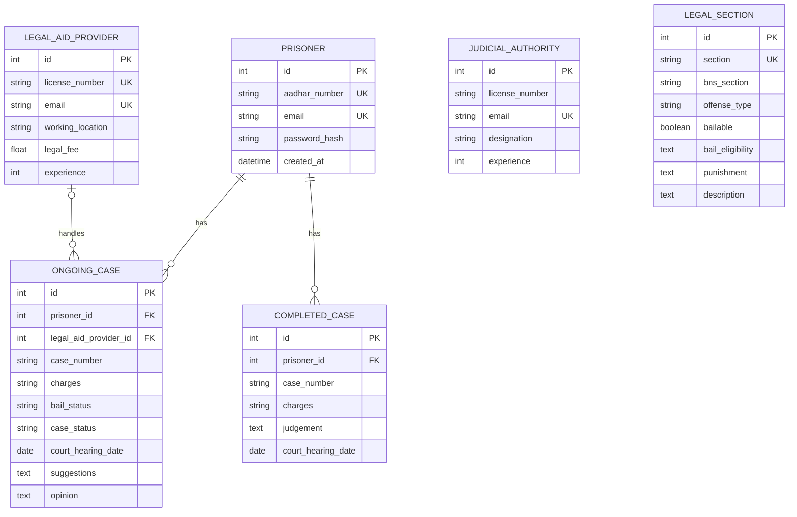

`JudicialAuthority` and `LegalSection` are currently standalone tables. Production
work should add explicit case-review/action records rather than putting a mutable
“last opinion” field in place of professional attribution.

### 11.2 Required production additions

| Entity / field | Purpose |
|---|---|
| `case_events` | Immutable actor, action, timestamp, prior state, new state, and reason |
| `professional_verifications` | Verification status, authority, evidence reference, review/expiry times |
| `legal_content_versions` | Canonical source, jurisdiction, effective dates, reviewer, approval status, change history |
| `provider_visibility` | Active status, directory consent, public contact preferences, service radius |
| `case_assignments` | Assignment start/end, provider, actor, reason, and transfer history |
| `external_identifiers` or tokenized identity reference | Reduce direct Aadhaar use as a routing key |
| `created_by` / `updated_by` | Attribution for controlled records where events alone are insufficient |

### 11.3 Data classification

| Classification | Examples | Required handling |
|---|---|---|
| Restricted identity data | Aadhaar, family Aadhaar, date of birth, address, phone | Field-level encryption/tokenization, masking, strict access, no application logs |
| Restricted legal data | Charges, evidence details, case summary, opinion, judgment | Encryption at rest, record-scoped access, audit reads and writes |
| Confidential professional data | License details, private working coordinates | Verification controls; reveal only approved directory fields |
| Public governed content | Approved section facts and public explanatory copy | Versioning, provenance, legal review, integrity checks |
| Operational metadata | Trace ID, latency, provider used, error class | No PII; controlled retention and access |

### 11.4 Retention and deletion

- Retention periods must be approved by legal/privacy stakeholders before pilot.
- Authentication logs, audit events, case records, and content versions may require
  different retention policies.
- User-facing deletion cannot erase records subject to lawful preservation; it must
  create a traceable request and apply the approved disposition.
- Backups must inherit deletion/retention schedules and remain encrypted.
- Test, demo, and analytics datasets must use synthetic or irreversibly de-identified data.

---

## 12. API Surface

All JSON endpoints are under `/api`. Paths retain legacy-compatible names in the
current baseline; a future versioned API may normalize naming without breaking the
bundled frontend.

| Domain | Endpoint | Baseline access | Required production access |
|---|---|---|---|
| Health | `GET /api/health` | Public | Public, minimal response |
| Auth | `POST /api/register` | Public | Public, throttled; professional approval workflow |
| Auth | `POST /api/login` | Public | Public, throttled; hardened session |
| Legal | `POST /api/get-bail-status` | Public | Public, throttled, source-governed |
| Providers | `POST /api/get-nearest-providers` | Public | Public, throttled, verified providers only |
| Providers | `GET /api/get-provider-location/{id}` | Public | Remove or restrict; do not expose precise coordinates |
| Cases | `POST /api/add-ongoing-case` | Any valid JWT | Authorized intake role |
| Cases | `POST /api/add-completed-case` | Any valid JWT | Replace with authorized case-completion transition |
| Cases | `GET /api/ongoing-cases` | Any valid JWT | Scoped role, paginated, redacted |
| Cases | `GET /api/completed-cases` | Any valid JWT | Scoped role, paginated, redacted |
| Cases | `GET /api/validate-aadhar/{aadhar}` | Any valid JWT | Own/scoped access; avoid raw identifier in URL |
| Cases | `GET /api/*-cases/{aadhar}` | Any valid JWT | Own/scoped access; avoid raw identifier in URL |
| Cases | `GET /api/all-cases/{aadhar}` | Any valid JWT | Own/scoped access; avoid raw identifier in URL |
| Work queue | `GET /api/pending-cases` | Any valid JWT | Verified legal aid provider; least-data view |
| Work queue | `GET /api/pending-opinions` | Any valid JWT | Judicial authority with scope |
| Actions | `POST /api/take-up-case/{id}` | Any valid JWT | Verified provider; atomic assignment |
| Actions | `POST /api/suggestion/{id}` | Any valid JWT | Assigned provider / permitted authority |
| Actions | `POST /api/submit-opinion/{id}` | Any valid JWT | Permitted judicial authority |
| Search | `POST /api/historical-cases` | Any valid JWT | Authorized professional; paginated and redacted |

### 12.1 API contract rules

- Use Pydantic request and response models; never serialize ORM internals.
- Return stable error codes, safe messages, and a trace ID where appropriate.
- Use 409 for conflicting assignments or invalid concurrent state transitions.
- Paginate all collections with deterministic ordering and bounded limits.
- Never place restricted identifiers in URLs in the production API; URLs are often
  retained in browser history, reverse-proxy logs, and monitoring tools.
- Add idempotency protection to case creation, assignment, and completion writes.
- Publish a versioning and deprecation policy before external consumers are supported.

---

## 13. Non-Functional Requirements

### 13.1 Security and privacy

| ID | Requirement |
|---|---|
| NFR-SEC-01 | No credentials or production secrets in source, images, logs, fixtures, or documentation |
| NFR-SEC-02 | HTTPS only in hosted environments; secure headers and same-origin defaults |
| NFR-SEC-03 | Server-side RBAC plus record- and jurisdiction-level authorization on every restricted route |
| NFR-SEC-04 | Encryption at rest for restricted fields and encrypted backups with managed key rotation |
| NFR-SEC-05 | Mask Aadhaar and other identifiers in UI/API output unless the exact task requires full value |
| NFR-SEC-06 | No restricted data in request URLs, analytics payloads, exception text, or ordinary logs |
| NFR-SEC-07 | Immutable audit events for sensitive reads, exports, role changes, assignments, opinions, and judgments |
| NFR-SEC-08 | Automated dependency, secret, and static security checks in CI; critical findings block release |
| NFR-SEC-09 | Threat model, privacy impact assessment, and applicable Indian legal/compliance review completed before pilot |

### 13.2 Performance and capacity

| Measure | Pilot target |
|---|---|
| Standard API read/write latency | p95 ≤ 500 ms under agreed pilot load, excluding external AI |
| Public page interactive readiness | ≤ 2.5 s p75 on a representative mid-range mobile connection |
| Rule-based legal lookup | p95 ≤ 750 ms |
| External AI timeout | Configured bounded timeout; fallback response returned without indefinite waiting |
| Collection size | Server-side pagination; default ≤ 100 and hard maximum ≤ 500 until a lower product limit is chosen |
| Concurrent provider assignment | Exactly one successful assignment for one unassigned case |

Targets must be validated with an agreed pilot traffic model; they are not a claim
about the current demo deployment.

### 13.3 Reliability and recovery

| Measure | Pilot target |
|---|---|
| Core availability | 99.5% monthly, excluding announced maintenance |
| Known-section availability during AI outage | 100% through deterministic fallback while the app/database are healthy |
| Recovery point objective | ≤ 24 hours for pilot; tighten after data criticality review |
| Recovery time objective | ≤ 4 hours for pilot |
| Backup restore test | At least quarterly and before major data migrations |
| Write integrity | Database transaction rollback on failure; no partial case transition |

### 13.4 Accessibility and compatibility

- Target WCAG 2.1 AA for all core journeys.
- Support keyboard-only operation, visible focus, programmatic labels, useful error
  association, adequate contrast, and non-color status cues.
- Support the current and previous major versions of Chrome, Edge, Firefox, and
  Safari at pilot launch.
- Support screen widths from 320 px upward without loss of primary actions.
- Do not place essential meaning only inside background images or generated text.

### 13.5 Maintainability and portability

- Python 3.11–3.12 baseline with pinned, cross-platform dependencies.
- A fresh clone must run locally with documented commands and no external account.
- Schema changes must use reviewed, reversible migrations; `create_all` is local
  bootstrap behavior, not the production migration strategy.
- Unit, service, API, and permission tests must run without remote AI services.
- New AI providers must be added behind the existing provider interface.
- Configuration must be environment-driven and validated at startup.

---

## 14. Observability and Operations

### 14.1 Required signals

| Signal | Examples | Privacy rule |
|---|---|---|
| Request health | Route template, status, latency, trace ID | Never log raw Aadhaar, case narrative, token, or password |
| Authentication | Success/failure count, role class, throttle event | Do not log entered email or credential details by default |
| Authorization | Allowed/denied policy, resource type, actor internal ID | Restrict access and retention; do not duplicate record content |
| Case workflow | Created, assigned, opinion added, completed, conflict | Store in governed audit events, not only application logs |
| AI orchestration | Selected provider, fallback count, timeout/error class, knowledge hit | Do not send case PII or user identity to the provider |
| Provider discovery | Result count, coarse distance bucket, filter usage | Do not log precise user or provider coordinates |

### 14.2 Operational readiness

- health/readiness checks distinguish process health from database readiness;
- alerts cover sustained 5xx rate, database failures, authentication abuse, backup
  failure, provider fallback spikes, and audit-event persistence failure;
- runbooks cover compromised credentials, unauthorized access, database recovery,
  content correction, provider outage, and mistaken case assignment;
- deployments use least-privilege database credentials and separate development,
  test, staging, and production configuration;
- a failed audit write blocks high-risk case mutations or enters an explicitly
  approved safe-degradation mode.

---

## 15. Legal-Content and AI Governance

### 15.1 Content publication workflow

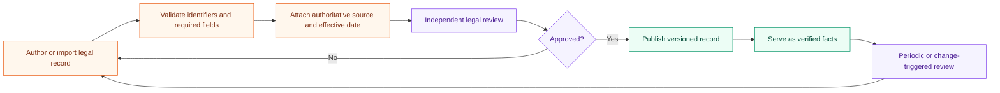

### 15.2 AI data-use boundaries

- Do not send Aadhaar, names, contact data, case summaries, evidence, opinions, or
  judgments to an external model for the public section-lookup use case.
- Prompts should contain only the section query and approved legal facts needed for
  explanatory content.
- Provider terms, retention, training use, hosting region, and incident practices
  require review before enabling a hosted provider in production.
- AI output must be treated as untrusted display content and rendered safely.
- Cache only approved, non-personal content, with provider/model/version metadata.
- The product must remain useful when every external AI integration is disabled.

---

## 16. Success Metrics

Instrumentation must be privacy-preserving and exclude restricted identifiers.

| Outcome | Metric | Initial target |
|---|---|---|
| Users understand a section | Successful known-section lookup rate | ≥ 95% for supported identifiers |
| Offline resilience | Known-section requests completed during simulated provider outage | 100% |
| Prisoner task completion | Authenticated users who can reach their own case summary without support | ≥ 90% in usability testing |
| Legal-aid coordination | Median time from eligible case publication to provider assignment | Baseline during pilot, then improve |
| Judicial workflow | Pending-opinion cases with attributable action history | 100% |
| Content trust | Published legal records with source, effective date, and approval | 100% |
| Privacy | Confirmed unauthorized cross-record disclosures | 0 |
| Reliability | Core monthly availability | ≥ 99.5% during pilot |
| Accessibility | Critical WCAG issues in core journeys | 0 at launch |

Guardrail metrics include authorization-denial spikes, repeated Aadhaar lookup
attempts, AI fallback rate, unknown-section rate, stale content count, assignment
conflicts, audit persistence failures, and provider directory complaints.

---

## 17. Delivery Plan

### Phase A — Modernized baseline (complete in repository)

- one FastAPI application and relational schema;
- Jinja2/static frontend served by the app;
- JWT authentication and role claims;
- case, provider, legal-info, and page route groups;
- seeded legal-section knowledge table;
- rule-based, Ollama, OpenRouter, and OpenAI provider abstraction;
- automated repository test suite and local zero-credential setup.

### Phase B — Production safety gate (P0)

- server-enforced role, record, assignment, and jurisdiction authorization;
- professional verification and removal of the client-only admin path;
- restricted-data encryption, masking, safer identifiers, and log redaction;
- auditable case events and atomic assignment/completion transitions;
- legal-content provenance, review, versioning, and user-facing disclaimers;
- secure session design, throttling, security headers, and abuse controls;
- PostgreSQL migrations, backups, restore test, monitoring, and incident runbooks;
- accessibility and mobile remediation;
- permission, concurrency, privacy, and failure-mode test coverage.

### Phase C — Controlled pilot (P1)

- deploy to isolated staging and production environments;
- onboard a limited set of verified professionals and synthetic/pilot-approved data;
- conduct legal, privacy, security, and accessibility sign-off;
- measure task completion, case hand-offs, answer quality, and support demand;
- resolve pilot findings before expanding geography or user volume.

### Phase D — Expansion (P2)

- reviewed multilingual experience;
- provider radius/map experience and directory self-service;
- notifications, reminders, and workload views;
- structured IPC/BNS historical search and approved analytics;
- carefully governed integrations only where ownership and lawful data exchange are clear.

---

## 18. Risks and Mitigations

| Risk | Impact | Mitigation / release gate |
|---|---|---|
| AI explanation is mistaken or conflicts with law | Harmful user action and loss of trust | Database facts lead; unknowns are refused; legal review, source metadata, disclaimer, and provider monitoring |
| Any valid account accesses another role’s data | Severe privacy and legal exposure | Server-side RBAC plus object-level policies and negative permission tests |
| Aadhaar appears in URLs, logs, or broad responses | Identity exposure | Tokenized/internal lookup, masking, encryption, and log/telemetry scrubbing |
| False professional registration | Unauthorized access or misleading directory entry | Manual/approved verification lifecycle before professional privileges |
| Two providers take the same case | Conflicting representation | Database-backed atomic assignment and 409 conflict handling |
| Separate completion write creates duplicate/inconsistent case | Broken case history | Transactional state transition and immutable case events |
| Provider locations expose sensitive addresses | Safety and privacy issue | Never return exact coordinates publicly; directory consent and coarse location |
| Legal content becomes stale during IPC/BNS transition | Incorrect guidance | Effective dates, versioning, periodic review, change-triggered content workflow |
| Free hosting sleeps or loses local SQLite data | Poor availability or data loss | Hosted PostgreSQL, backups, readiness checks, and realistic hosting tier |
| External AI sends or retains personal data | Privacy breach | Section-only prompts, provider review, outbound controls, and AI-off mode |

---

## 19. Assumptions, Dependencies, and Open Decisions

### 19.1 Assumptions

- English is the baseline language; localization follows reviewed content processes.
- The bundled web frontend is the only supported client until an API consumer policy exists.
- SQLite is for local development and tests; hosted use requires PostgreSQL.
- Existing repository data is demo data and is not a production migration source.
- Provider distance is straight-line Haversine distance, not road travel time.
- Legal information covers only approved records present in the governed knowledge base.

### 19.2 Dependencies

- qualified Indian criminal-law reviewers and an accountable content owner;
- privacy and security review for Aadhaar and case-data handling;
- a professional-verification process and authoritative verification source;
- managed PostgreSQL, secret management, encrypted backups, and monitoring;
- pilot partners who can validate workflow roles, jurisdiction, and correction paths;
- optional AI provider only after its data-handling terms are approved.

### 19.3 Open product decisions

| Decision | Recommended direction | Owner needed |
|---|---|---|
| Who may create an ongoing case? | Judicial authority or verified intake operator; prisoner-submitted drafts require review | Product + legal operations |
| Should Aadhaar remain the primary lookup key? | Use an internal case/identity token and keep Aadhaar only where demonstrably necessary | Privacy + legal |
| What defines judicial jurisdiction? | Explicit court/organization assignment rather than global role access | Legal operations |
| Who approves legal-aid providers? | Named verification authority with expiry and suspension workflow | Legal operations |
| What is the authoritative legal-content source set? | Versioned government/official sources approved by legal reviewer | Legal content owner |
| What are the case and audit retention periods? | Define per data class and legal obligation before pilot | Privacy + legal |
| Can a provider decline or transfer a case? | Yes, with reason, history, and reassignment controls | Product + legal aid partners |
| Which pilot geography and languages apply? | Start with one governed jurisdiction and English; expand after validation | Program owner |

---

## 20. Release Acceptance Scenarios

A real-person pilot is ready only when all P0 requirements pass in an environment
configured like production.

### Scenario A — Secure identity and isolation

1. Register one user in each supported role.
2. Verify professional accounts through the approved workflow.
3. Sign in and confirm each user sees the correct dashboard.
4. Attempt every cross-role and cross-record request directly against the API.
5. Confirm unauthorized requests return 403/404-safe responses and create audit evidence.

### Scenario B — Known legal section with provider outage

1. Submit an approved `IPC_XXX` identifier.
2. Simulate the configured external provider being unavailable.
3. Confirm the response still includes approved facts, rule-based guidance, source
   metadata, provider/fallback label, and limitation copy.
4. Confirm no personal data is present in the outbound provider request or logs.

### Scenario C — Unknown or malformed section

1. Submit a malformed identifier and confirm a clear 400 response.
2. Submit a well-formed but unknown identifier.
3. Confirm the product does not assert a bail status and directs the user to verify
   the section or contact qualified help.

### Scenario D — Provider discovery

1. Grant location consent and set fee/experience filters.
2. Confirm only active, verified, matching providers are returned nearest-first.
3. Confirm precise provider and user coordinates are absent from response cards and logs.
4. Confirm no-match behavior is useful and non-blocking.

### Scenario E — Complete case lifecycle

1. An authorized actor creates a valid ongoing case for an existing prisoner.
2. The prisoner sees only their own case summary.
3. Two providers attempt assignment concurrently; exactly one succeeds.
4. The assigned provider adds a suggestion.
5. A permitted judicial authority records an opinion and completes the case.
6. Confirm the active case closes once, the completed outcome is searchable by an
   authorized professional, and every action is attributable in the event history.

### Scenario F — Operational recovery

1. Run the full automated test suite with external AI disabled.
2. Apply database migrations to a staging snapshot.
3. Restore an encrypted backup into an isolated environment.
4. Verify health checks, alerts, log redaction, and core read/write workflows.
5. Record sign-off from product, engineering, security/privacy, accessibility, and
   legal-content owners.

---

## 21. Repository Traceability

| Product area | Current implementation |
|---|---|
| Application composition | `app/main.py` |
| Configuration | `app/core/config.py`, `.env.example` |
| Authentication primitives | `app/core/security.py`, `app/services/auth.py` |
| Data models | `app/models/` |
| API contracts | `app/schemas/` |
| Case workflows | `app/api/routes/cases.py`, `app/services/cases.py` |
| Provider discovery | `app/api/routes/providers.py`, `app/services/providers.py` |
| Bail-information orchestration | `app/api/routes/legal.py`, `app/services/legal_info.py` |
| AI providers and fallback | `app/services/ai/` |
| Legal-section seed data | `data/ipc_sections.csv`, `app/db/seed.py` |
| Web experience | `frontend/templates/`, `frontend/static/` |
| Automated tests | `tests/` |

The original modernization sequence remains available in
[`EXECUTION_PLAN.md`](EXECUTION_PLAN.md); the pre-modernization findings remain in
[`AUDIT.md`](AUDIT.md). This PRD is the controlling description of the product,
target operating model, and release gates going forward.

---

## 22. Definition of Done

Bail Reckoner is production-ready for a controlled pilot when:

- every P0 requirement and acceptance scenario passes;
- verified legal facts are sourced, versioned, reviewed, and clearly separated from AI text;
- role, record, assignment, and jurisdiction controls are enforced by the server;
- Aadhaar and case PII are minimized, protected, masked, and absent from logs/URLs;
- case assignment and completion are atomic, auditable state transitions;
- the system runs without external AI and fails safely when optional providers fail;
- migrations, monitoring, backups, restore procedures, and incident runbooks are proven;
- accessibility, privacy/security, legal-content, product, and engineering owners sign off;
- a new developer can set up, test, and operate the approved deployment from the
  repository documentation alone.
